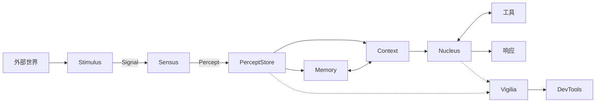

# CIEL シエル

## 1. 项目介绍

Ciel 是一个面向持续感知型 AI Agent 的认知核心。

它持续接收画面、声音和文字，将原始输入转换为统一的感知记录，再结合上下文、长期记忆和工具完成思考与响应。

```text
看见、听见、阅读
        ↓
形成感知与上下文
        ↓
记忆、思考、行动
```

项目名来自《**关于我转生变成史莱姆这档事**》中的“智慧之王／夏尔（Ciel）”。项目希望构建的不是一次性问答接口，而是一个能够持续观察环境、保留经历并主动思考的 Agent 运行时。

目前项目已经包含：

- 视觉、音频和文字输入；
- 画面变化采样、VAD、ASR 和说话人识别；
- 统一的感知记录与多模态模型上下文；
- Agent 推理、工具调用和主动思考调度；
- 长期记忆、经历归档和语义召回；
- 运行轨迹、WebSocket Bridge 和可视化 DevTools。

## 2. 核心概念

| 概念             | 简单说明                                                     |
| ---------------- | ------------------------------------------------------------ |
| **Stimulus**     | 外部信息源，例如直播间、麦克风或文字消息源。                 |
| **Signal**       | Stimulus 产生的原始输入。Ciel 内置 Photon、Echo 和 Script。  |
| **Photon**       | 一帧视觉数据。                                               |
| **Echo**         | 一段音频数据。                                               |
| **Script**       | 外部已经提供的文字数据。                                     |
| **Sensus**       | 感知入口，负责把不同 Signal 交给对应的感官能力。             |
| **Oculus**       | 视觉能力，将 Photon 转换为 Sight。                           |
| **Auris**        | 听觉能力，对 Echo 执行 VAD、ASR 和说话人识别，生成 Hearing。 |
| **Lectio**       | 阅读能力，将 Script 对齐为 Reading。                         |
| **Percept**      | Ciel 已经形成的感知，包括 Sight、Hearing 和 Reading。        |
| **PerceptStore** | 按时间追加 Percept，并让认知和记忆分别消费。                 |
| **Context**      | 将人格、记忆、近期感知和应用消息整理为模型输入。             |
| **Nucleus**      | 认知核心，负责调度思考、调用模型和使用工具。                 |
| **Memory**       | 保存长期信息、每日经历并提供语义召回。                       |
| **Vigilia**      | 只读可观测层，记录运行状态、耗时、模型步骤和工具调用。       |
| **Bridge**       | 将 Vigilia 事件通过 WebSocket 提供给外部客户端。             |
| **DevTools**     | 展示对话与运行轨迹的可视化检查器。                           |

三种基础输入与感知结果的对应关系：

| Signal | 感官能力 | Percept |
| ------ | -------- | ------- |
| Photon | Oculus   | Sight   |
| Echo   | Auris    | Hearing |
| Script | Lectio   | Reading |

## 3. 架构



主流程只有三层：

1. **感知**：Stimulus 产生 Signal，Sensus 将其转换为 Percept。
2. **认知**：PerceptStore 保存感知，Context 组织模型输入，Nucleus 完成思考和行动。
3. **记忆与观测**：Memory 保存经历；Vigilia 在旁路记录运行事实，不参与业务决策。

## 4. 怎么使用

### 4.1 准备环境

项目使用 Node.js 24、pnpm 11 和 Vite+：

```powershell
vp install
```

如果需要听觉能力，先安装 ASR、VAD 和说话人模型：

```powershell
vp run asr:install
```

运行 Bilibili 直播示例还需要系统能够执行 **ffmpeg**。

### 4.2 运行直播示例

配置一个同时支持图片输入和 embeddings 的 OpenAI-compatible 模型：

```powershell
$env:BLIVE_AI_API_KEY='...'
$env:BLIVE_AI_MODEL='provider/model'
$env:BLIVE_AI_BASE_URL='https://openrouter.ai/api/v1'
```

启动 Ciel：

```powershell
vp -C apps/blive run start
```

示例会连接直播输入，启动 Ciel、Memory 和 Vigilia Bridge。默认 Bridge 地址为 **http://localhost:3000**。

### 4.3 打开 DevTools

另开一个终端：

```powershell
Set-Location packages/devtools
vp dev
```

打开 **http://localhost:4173** 查看实时数据；打开 **http://localhost:4173/?demo** 可以直接查看内置演示轨迹。

DevTools 提供两个视图：

- **对话**：展示 ASR 结果和模型最终消息；
- **轨迹**：展示感知、上下文、记忆、模型和工具调用步骤。

### 4.4 在代码中组装 Ciel

```ts
import { BilibiliLive } from '@ciels/blive';
import { Ciel, Memory } from '@ciels/core';

const stimulus = new BilibiliLive({ roomId: 24680 });
const memory = new Memory({
  path: '.ciel-data/memory.db',
  embedder,
  model,
  resourceId: 'blive:24680',
});

const ciel = new Ciel(stimulus, {
  nucleus: {
    model,
    memory,
  },
  oculus: {
    differenceThreshold: 0.03,
    sampleInterval: 0,
  },
});

ciel.on('data', percept => console.log(percept));
ciel.on('thought', output => console.log(output));
ciel.on('error', error => console.error(error));

await ciel.start();
```

应用负责提供 Stimulus、模型、Memory 和业务工具；Ciel 负责感知、上下文组织和认知调度。

## 5. 项目结构

```text
ciel/
├── apps/
│   └── blive/              # Bilibili 直播场景与可运行入口
├── packages/
│   ├── core/               # 感知、上下文、记忆、认知和 Vigilia
│   ├── asr/                # VAD、ASR、时间戳和说话人识别
│   ├── event/              # 支持同步与异步监听的类型化事件
│   ├── bridge/             # Vigilia WebSocket 服务与客户端
│   └── devtools/           # 可嵌入、可独立部署的运行检查器
├── .ciel-data/             # 模型、声纹、视觉快照和记忆数据
├── vite.config.ts          # Vite+ 工作区配置
└── package.json
```

### packages/core/src

```text
packages/core/src/
├── ciel/                   # 顶层实例、生命周期和事件绑定
├── signals/                # Photon、Echo、Script
├── stimulus/               # 外部输入源契约
├── sensus/                 # Sensus、Oculus、Auris、Lectio
├── percepts/               # Sight、Hearing、Reading、PerceptStore
├── context/                # 模型输入与视觉投影
├── nucleus/                # 思考调度和 Agent 执行
├── memory/                 # 长期记忆与经历归档
└── vigilia/                # 运行事件、Snapshot 和 OTel
```

### Package 职责

| Package                   | 职责                                 |
| ------------------------- | ------------------------------------ |
| **@ciels/core**           | Ciel 的主要运行时和公共 API。        |
| **@ciels/asr**            | 底层语音识别、VAD 和说话人能力。     |
| **@ciels/event**          | 运行时内部使用的类型化事件基础设施。 |
| **@ciels/vigilia-bridge** | 将 Vigilia 暴露为 WebSocket 服务。   |
| **@ciels/devtools**       | 可嵌入组件和完整可部署检查器。       |
| **@ciels/blive**          | Bilibili 直播 Stimulus 与示例应用。  |

## 6. 开发

常用命令：

```powershell
vp install
vp check
vp test
vp run -r build
```

只检查或构建单个包：

```powershell
vp -C packages/core check
vp -C packages/core test
vp -C packages/core pack
```

运行时数据统一写入 **.ciel-data**，该目录不会提交到 Git：

```text
.ciel-data/
├── models/
├── voiceprints/
├── sights/
└── memory.db
```

## 7. 更多文档

- [Core](./packages/core/README.md)：公共 API、感知管线和运行时配置。
- [ASR](./packages/asr/README.md)：模型安装、音频格式和说话人识别。
- [Blive](./apps/blive/README.md)：Bilibili 直播接入和 FFmpeg 配置。
- [Bridge](./packages/bridge/README.md)：WebSocket 协议和客户端。
- [DevTools](./packages/devtools/README.md)：组件 API、开发和部署产物。
