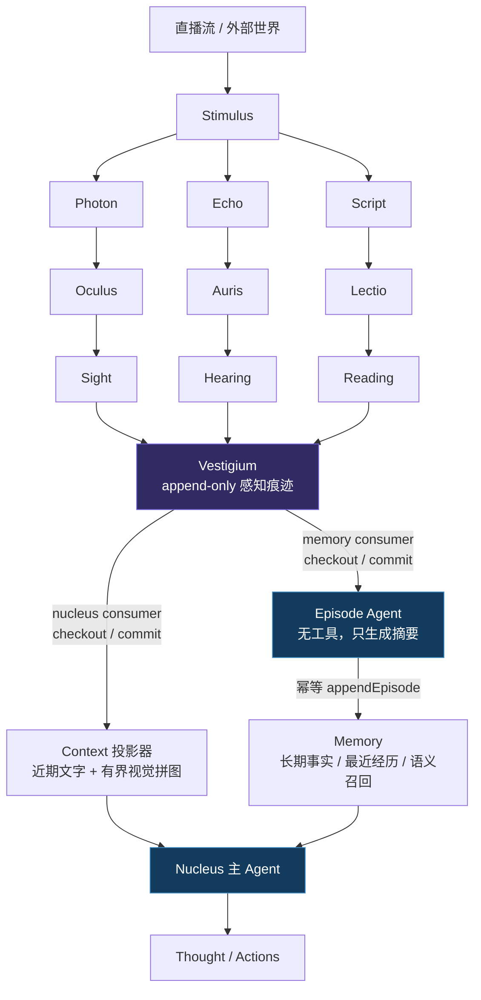
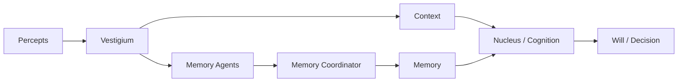

# CIEL シエル

Ciel 是一个面向 AI Agent 的认知核心系统。

项目名来自《**关于我转生变成史莱姆这档事**》主角
[**利姆鲁**](https://baike.baidu.com/item/%E5%88%A9%E5%A7%86%E9%B2%81%C2%B7%E7%89%B9%E6%81%A9%E4%BD%A9%E6%96%AF%E7%89%B9/22945511?fromModule=lemma_inlink)
的技能“智慧之王／夏尔（Ciel）”。这个名字表达了项目的长期目标：构建一个能够接收感官信息、形成上下文，并逐步拥有记忆、推理与行动能力的 Agent 核心。

对于视觉和听觉，Ciel 不会先把外部世界统一转换成文本，而是让 Agent 从原始刺激中形成自己的感知；外部已经提供的符号信息则由 `Lectio` 对齐为 `Reading`，不再执行额外的内容理解：

```text
World
  → Stimulus
      → Signals
      → Sensus
      → Percepts
  → Vestigium
      → Nucleus / Context / Reasoning
      → Episode Agent / Memory
  → Response
```

当前阶段聚焦直播场景下的感官基础：接收连续媒体流，将画面和声音转换为 Ciel 内部统一的视觉、听觉感知对象，为后续记忆、理解和决策提供输入。

## 设计哲学

Ciel 严格分离四种职责：

1. 原始感官信号；
2. 感知处理；
3. 可直接进入大脑的符号输入；
4. 认知理解。

```text
Sensory Path:
Raw Signal
  → Sensus
  → Percept
  → Vestigium
  → Nucleus / Memory

Symbolic Path:
Script
  → Sensus
  → Lectio
  → Reading
  → Vestigium
```

`Sensus` 是所有信号统一进入感知层的入口。`Photon`、`Echo` 和 `Script` 分别交由 Oculus、Auris、Lectio 转换；`Script` 已经是外部世界提供的符号信息，因此 Lectio 只将其对齐为 `Reading`，不再执行额外的内容理解。感知层不负责最终推理，高层认知也不直接处理媒体编码细节。

项目遵循以下原则：

- 信号对象不可变，只携带数据和时间。
- 感知模块只依赖信号契约，不反向依赖信号生产者。
- 模块之间优先通过事件通信。
- 感知层不直接耦合 LLM。
- 运行时生成的数据统一保存在 `.ciel-data`。

## 整体架构



关键边界是：感知结果只追加一次，Context 与 Memory 各自消费。子 Agent 不持有 Memory
写权限；它只返回摘要，最终落库与 Vestigium 游标提交仍由确定性代码完成。

当前仓库是一个 Vite+ monorepo：

```text
ciel/
├── apps/
│   └── webui/            # Vue 管理与展示界面
├── packages/
│   ├── core/             # 通用信号、感知结果与视觉处理
│   ├── asr/              # ASR、VAD、说话人识别与 CLI
│   ├── event/            # 支持同步与异步监听的类型化事件包
│   └── bridge/           # WebSocket 服务和客户端桥接
├── .ciel-data/           # 模型、声纹和感知产物，不提交到 Git
├── vite.config.ts        # 工具链和项目任务
└── package.json
```

`packages/core/src` 的主要结构：

```text
packages/core/src/
├── signals/              # Photon、Echo、Script
├── stimulus/             # 外部刺激输入契约
├── percepts/             # Sight、Hearing、Reading 感知产物
├── sensus/               # Auris、Oculus、Lectio 感官处理层
├── context/              # 基础定义与多模态 Percept 上下文构建
├── vestigium/            # 追加式感知痕迹、独立消费者游标与安全回收
├── memory/               # 长期记忆、Episode 子 Agent 与工具
├── nucleus/              # 上下文投影、记忆组装、思考与调度
├── constants/
└── utils/
```

## 模块职责

### Signals

`signals` 定义低层、不可变的感官信号。

它们只描述“世界向 Ciel 传来了什么”，不描述这些信息意味着什么。

#### Photon

`Photon` 表示视觉刺激，即 Ciel 接收到的一帧光学信息：

```ts
interface PhotonFrame {
  data: Buffer;
  timestamp: Date;
}
```

它不包含图像描述、标签或模型推理结果。

#### Echo

`Echo` 表示听觉刺激：

```ts
interface EchoSegment {
  data: Buffer;
  startAt: Date;
  endAt: Date;
}
```

它不包含转写文本、说话人语义或内容解释。

#### Script

`Script` 表示外部世界直接提供的符号化文字刺激，例如直播字幕、平台消息或上游已经整理好的文本：

```ts
interface ScriptData {
  content: string;
  timestamp: Date;
}
```

文字信号与音频转写结果保持独立：

- `Script` 是外部世界直接提供的文字信号；
- `Reading` 是 `Script` 经 Lectio 统一包装后的符号感知；
- `Hearing` 是 `Echo` 经 Auris 处理后形成的听觉感知。

`Percept` 是 `Hearing | Reading | Sight` 的联合类型。每种感知产物都通过单个 `originSignal: SignalConstructor` 标明其原始信号类型。

`Script` 不进入 Oculus 或 Auris，也不需要再次执行 ASR 或视觉理解。Stimulus 通过统一的 `data` 事件发出自带 `type: 'script'` 的信号后，Sensus 将其交给 Lectio 对齐为 `Reading`，再发送至 Nucleus。

### Stimulus

`Stimulus` 是外部世界的输入层。

它负责：

- 建立和关闭外部数据源；
- 解码或整理媒体数据；
- 创建 `Photon`、`Echo`、`Script`；
- 通过事件发送信号。

```ts
interface StimulusEventMap {
  data(data: Echo | Photon | Script): void;
}
```

`Stimulus` 不理解内容，也不产生 `Sight` 或 `Hearing`。

每个刺激源通过 `signals` 显式声明可能发送的具体信号类型，并通过聚合的 `data` 事件发送信号。消费者根据信号自带的 `type` 字段区分 `echo`、`photon` 与 `script`：

```ts
const signals = [LiveEcho, LivePhoton, DanmuScript] as const;

class LiveStimulus extends Stimulus<typeof signals> {
  static readonly meta = {
    name: 'Bilibili 直播间',
    description: '一个持续发生视听与弹幕互动的直播场景',
  };

  readonly signals = signals;

  async start() {
    await this.send(new LiveEcho(audioSegment));
  }

  async stop() {}
}
```

`send()` 会拒绝未在 `signals` 中声明的实例，并通过 `@ciels/event` 的异步事件等待 Ciel 完成对应的感官处理。

### Ciel

`Ciel` 负责绑定刺激源、发现信号、自动创建处理器和管理生命周期：

```ts
const ciel = new Ciel(new LiveStimulus(), {
  auris: {
    bufferSeconds: 30,
  },
  oculus: {
    sampleInterval: 6_666.67,
    differenceThreshold: 0.03,
  },
});

await ciel.start();
await ciel.stop();
```

每个 Ciel 在实例化时必须传入且只绑定一个 Stimulus。启动时，Ciel 为它创建一个独立的 `Sensus`。Sensus 接收该 Stimulus 声明的全部 Signal class，并自动匹配感官能力：

- `Echo` 子类创建独立的 `Auris`；
- `Photon` 子类创建独立的 `Oculus`；
- `Script` 子类创建独立的 `Lectio`，对齐为 `Reading` 后再通过 Ciel 的 `data` 事件发送。

Sensus 以 Stimulus 实例为作用域，其内部的感官能力以具体 Signal class 为作用域。处理后的 Percept 进入该 Ciel 的 Vestigium，每条记录保留 `sequence`、`stimulus`、场景、Signal 来源、时间与原始 Percept。Nucleus 和记忆归档分别通过独立消费者游标读取，不再共享一个会被删除的实时数组。

### Vestigium、Context、Memory 与 Nucleus

四层保持单一职责：Vestigium 记录感知事实；Context 将指定 checkout 投影成模型输入；Memory 保存长期事实和 Episode；Nucleus 负责思考、工具与调度。Ciel 提供可由子类覆盖的 `Soul` 与 `IDENTITY` 纯文本，Context 统一添加标题：

```text
# SOUL

你是夏尔。保持理性、温和与好奇。

# IDENTITY

名字：夏尔
形象：暂无固定形象
身份：Ciel 的认知主体

# MEMORY

用户希望回答保持简洁。

# 基础定义

## Bilibili 直播间
一个持续发生视听与弹幕互动的直播场景

## 直播弹幕
观众实时发送的弹幕

# 本轮输入

[触发原因]
感知更新

# 最近经历

# 2026-08-11

## 12:29:00

用户此前正在检查直播画面。

# 基础数据

[直播弹幕]
[2026-08-11T12:30:00.000Z] 右边是不是漏了？
```

一个 Ciel 只拥有一个 Nucleus。Nucleus 负责完整的思考、工具调用和总结调度，应用配置模型、Memory、总结阈值、自定义消息与行动工具：

```ts
import { Ciel, Memory } from '@ciels/core';
import { isStepCount, jsonSchema, Output, tool } from 'ai';

const stimulus = new LiveStimulus();

class LiveCiel extends Ciel {
  protected override readonly Soul = '你是夏尔。保持理性、温和与好奇。';
  protected override readonly IDENTITY = [
    '名字：夏尔',
    '形象：暂无固定形象',
    '身份：长期陪伴用户的认知主体',
  ].join('\n');
}

const ciel = new LiveCiel(stimulus, {
  nucleus: {
    context: { perceptWindow: 60_000, maxImages: 4 },
    model,
    memory: new Memory({
      path: '.ciel-data/memory.db',
      embedder: embeddingModel,
    }),
    memorySummary: { idleTimeout: 60_000, maxTokens: 500_000 },
    tools: {
      sendMessage: tool({
        description: '向当前场景发送一条消息',
        inputSchema: jsonSchema<{ content: string }>({
          type: 'object',
          properties: { content: { type: 'string' } },
          required: ['content'],
          additionalProperties: false,
        }),
        execute: ({ content }) => liveRoom.sendMessage(content),
      }),
    },
    output: Output.object({ schema: DecisionSchema }),
    stopWhen: isStepCount(8),
    minThinkInterval: 10_000,
    maxThinkInterval: 60_000,
  },
});

await ciel.start();
const nucleus = ciel.getNucleus();
const context = await ciel.getContext();
const vestigium = ciel.getVestigium();
```

Memory 复用 Mastra Memory，并通过 LibSQL 持久化：resource-scoped Working Memory 保存精炼后的全局记忆，`YYYY-MM-DD` thread 保存每日经历，LibSQLVector 为经历建立向量。Nucleus 提供 `memory_update` 更新完整全局记忆，并提供 `memory_recall` 让 Agent 按语义跨日期搜索经历；最近日期的经历仍会直接进入 Context。

单轮模型输入达到 `memorySummary.maxTokens`、超过 `memorySummary.idleTimeout` 没有新事件，或 Ciel 停止时，记忆消费者会 checkout 尚未归档的 Vestigium 记录。无工具的 Episode Agent 将文字与有界视觉拼图总结成纯文本，Nucleus 使用稳定幂等键写入当天 thread，成功后才提交记忆游标；失败会退避重试。损坏图片降级为包含 Vestigium sequence 的文字证据，不会卡住整批归档。主思考与记忆归档使用不同消费者，因此归档模型运行不会占用主思考 checkout。

主思考只把新视觉记录组成拼图，成功后提交自己的游标；失败时重复相同 checkout，调用期间追加的记录留到下一轮。近期文字可以按 `perceptWindow` 再次投影为对话上下文。两个消费者都已提交且记录离开实时窗口后，进程内 Vestigium 才会回收该记录。输入 token 优先使用模型提供方返回的实际用量；API 未返回时，图片按 16 像素 patch、2×2 空间合并及 8192–8388608 像素缩放区间估算。

`minThinkInterval` 限制普通活跃事件的思考频率；`maxThinkInterval` 在没有新感知时仍会给 Nucleus 一次主动判断的机会，但不强制对外输出。`triggerPolicy(record)` 可以对每条 Vestigium 记录返回 `immediate`、`scheduled` 或 `passive`。`Hearing` 默认立即触发，因此 Auris 在 VAD/ASR 结束一段语音并产出 Hearing 后，可以绕过最小间隔；应用也可让特定弹幕、视觉事件或控制消息提前触发。
Nucleus 会把 `percept`、`interval` 与 `manual` 三种触发原因放入本轮输入，main Agent 可以据此判断是否需要主动互动。

Nucleus 只区分内部内容与应用自定义内容，并按顺序直接拼接：

- 内部 system：SOUL、IDENTITY、MEMORY 与 Context 基础定义；
- `system`：追加在内部 system 后的应用自定义提示词，不解释其人格、规则等语义；
- 内部实时消息：触发原因、最近经历和当前 Percept；
- `messages`：追加在内部实时消息后的应用自定义 `ModelMessage`；
- `tools`：真实行动能力；具有外部副作用的工具应按需配置 AI SDK `toolApproval`。

`Soul`、`IDENTITY`、全局记忆、`Stimulus.meta`、`Signal.meta` 和 `system` 都会进入 system，因此只应包含受信任内容；用户输入、网页内容等不可信数据应通过 Percept 或 `messages` 注入。

### Sensus

`Sensus` 是统一的感知入口。它接收全部已声明的 Signal class，创建对应的 Auris／Oculus／Lectio 能力，并将信号转换或对齐为 Percept。调用 `process(signal)` 会等待真实的同步或异步处理完成，不额外维护任务队列；调用 `close()` 会 flush 并释放内部能力。

单项感官能力统一继承 `SensusBase<TSignal, TData>`，并通过 `SensusEventMap<TData>` 暴露 `data` 与 `error` 事件。构造函数统一采用 `(signal, options)`，由泛型决定输入 Signal 和输出 data 类型；Sensus 继续通过 `data` 发送 `Percept`，消费者使用其 `type` 区分 `hearing`、`reading` 或 `sight`。

### Lectio

`Lectio` 是 Ciel 的阅读感官。它不执行额外的内容理解，只校验收到的 `Script` 是否属于其绑定的信号类型，并将内容、时间及原始信号元数据对齐为 `Reading`。

### Oculus

`Oculus` 是 Ciel 的视觉感知器官。

处理流程：

```text
Photon[]
  → 时间采样
  → 低分辨率灰度差异比较
  → 持久化每个变化帧
  → 单帧 Sight
  → Vestigium 追加记录
  → 消费者 checkout 本轮新增帧
  → 每 9 帧组成 1920 × 1080 上下文拼图
```

Oculus 将每个采样帧缩小为 64 × 36 灰度指纹，与上一张已经保留的帧计算平均像素差异；达到 `differenceThreshold` 才持久化并产生单帧 `Sight`。比较只用于去除重复画面，输出给多模态模型的仍是原始 Photon 生成的彩色 JPEG，不使用灰度缩略图。

默认每分钟采样 9 帧。Nucleus 组装一次模型 Context 时，从自己的 Vestigium checkout 中按 Stimulus 与 Photon 类型分组，每 9 帧组成一张 3 × 3 拼图；不足 9 帧也使用自适应排版。`context.maxImages` 限制单轮拼图数量；候选超过预算时在整段时间线上保留首尾并均匀采样，避免长时间讲话只留下最后几秒。模型调用成功后提交整个稳定 checkout，失败时保留同一批供下次重试，调用期间新到的帧留到下一轮。原始 Sight 仍由 Vestigium 管理，不因提示词图片预算而立即丢弃。默认 `differenceThreshold` 为 `0.03`，设为 `0` 可恢复为保留所有采样帧。

`Sight` 只描述一次已经持久化的视觉观察：

```ts
interface SightOptions {
  path: string;
  startAt: Date;
  endAt: Date;
}
```

默认视觉产物保存在：

```text
.ciel-data/sights/
```

`Oculus` 不调用视觉 LLM，也不生成图片语义描述。后续视觉分析器应消费 `Sight`，而不是侵入 `Oculus`。

### ASR / Auris

`@ciels/asr` 提供底层语音识别能力；`@ciels/core` 中的 `Auris` 是面向 `Echo`、产出 `Hearing` 的上层封装。

当前已经支持：

- 连续音频块输入；
- 可配置环形缓冲区；
- Silero VAD 端点检测；
- sherpa-onnx 流式语音识别；
- 句子和 Token 级时间戳；
- 预注册声纹识别；
- 未知说话人在线聚类；
- 声纹创建脚本；
- 模型安装脚本。

处理流程：

```text
Echo (16 kHz mono s16le)
  → Float32 PCM
  → CircularBuffer
  → Silero VAD
  → OnlineRecognizer
  → Speaker Embedding
  → Voiceprint Match / Online Clustering
  → Hearing
```

`Auris` 接受连续的 `Echo`，但只在 VAD 确认一句语音结束后产生最终 `Hearing`，不会伪造逐 Token 临时结果。

#### 安装模型

```powershell
vp run asr:install
```

强制重新安装：

```powershell
vp run asr:install -- --force
```

模型会写入：

```text
.ciel-data/
├── downloads/
└── models/
   ├── asr/
   ├── vad/
   │  └── silero_vad.onnx
   └── speaker/
      └── model.onnx
```

#### 创建声纹

输入文件必须为单声道、16 kHz WAV。同一说话人可以提供多个样本：

```powershell
vp run asr:voiceprint -- `
  --output alice.voiceprint `
  ./samples/alice-1.wav `
  ./samples/alice-2.wav
```

输出文件位于：

```text
.ciel-data/voiceprints/alice.voiceprint
```

多个样本会分别提取 embedding，再经过平均和归一化生成最终声纹。

#### 配置

```ts
interface ASROptions {
  speaker?: readonly {
    name: string;
    file: string;
  }[];
  bufferSeconds?: number;
  speakerThreshold?: number;
  maxSpeakers?: number;
}
```

| 配置               | 默认值 | 说明                            |
| ------------------ | -----: | ------------------------------- |
| `speaker`          |   `[]` | 已注册说话人及其声纹文件        |
| `bufferSeconds`    |   `30` | 环形输入缓冲区和 VAD 缓冲区容量 |
| `speakerThreshold` |  `0.6` | 声纹与聚类中心的余弦相似度阈值  |
| `maxSpeakers`      |    `8` | 最多创建的匿名说话人数量        |

说话人识别始终启用，不提供关闭选项。声纹文件名相对于 `.ciel-data/voiceprints` 解析，并且不能访问该目录之外的文件。

匹配预注册声纹时，`Hearing.speaker` 返回业务名称。未匹配时，会在当前会话中生成稳定的 `speaker_0`、`speaker_1` 等匿名标签。

#### 使用

```ts
import { Auris, Echo } from '@ciels/core';

class MyEcho extends Echo.WithMeta({
  name: 'Microphone',
  description: 'Primary microphone audio',
}) {}

const auris = new Auris(MyEcho, {
  bufferSeconds: 30,
  speaker: [
    {
      name: 'alice',
      file: 'alice.voiceprint',
    },
  ],
});

auris.on('data', hearing => {
  console.log('[' + hearing.speaker + '] ' + hearing.content);
});

auris.on('error', error => {
  console.error(error);
});

auris.process(echo);
auris.flush();
```

`Echo.data` 在进入 `Auris` 时必须是 16 kHz、单声道、signed 16-bit little-endian PCM。数据没有按 16-bit 样本对齐时会触发 `error` 事件。

#### Hearing

```ts
interface Hearing {
  readonly content: string;
  readonly speaker?: string;
  readonly confidence?: number;
  readonly startAt: Date;
  readonly endAt: Date;
  readonly tokens?: readonly HearingToken[];
  readonly originSignal: SignalConstructor;
}

interface HearingToken {
  content: string;
  startAt: Date;
  endAt: Date;
}
```

`startAt` 和 `endAt` 根据 VAD 音频位置与原始 `Echo.startAt` 换算。Token 时间戳来自识别器结果，并映射为绝对时间。

短语音、重叠语音、强噪声以及录音设备差异可能降低说话人识别准确率。

### Events

Ciel 使用轻量事件驱动通信。Sensus 统一消费信号并发送结果：

```text
Sensus emits data(Percept)
Percept.type = hearing | reading | sight
  → Vestigium.append(record)
      → nucleus consumer
      → memory consumer
```

这种方式使信号生产者、具体感官能力和后续认知模块保持独立。

### Bridge 与 WebUI

`packages/bridge` 提供基于 Elysia 的 WebSocket 服务、协议类型以及浏览器和 Vue 客户端。

`apps/webui` 是 Vue 应用，用于后续展示感知结果、运行状态和 Agent 交互。目前二者仍处于基础设施阶段，不属于已经完成的认知核心。

## 数据目录

所有运行时生成或下载的数据统一放在 `.ciel-data`：

```text
.ciel-data/
├── downloads/            # 临时模型下载
├── models/               # ASR、VAD、说话人模型
├── voiceprints/          # 已创建的声纹
├── sights/               # Oculus 视觉快照
└── memories/             # 长期记忆与每日 Episode
```

该目录已加入 `.gitignore`。

## 当前实现状态

| 能力                         | 状态     |
| ---------------------------- | -------- |
| 原始视觉、音频、文字信号     | 已实现   |
| Stimulus 输入契约与事件      | 已实现   |
| Oculus 变化采样与上下文拼图  | 已实现   |
| Sight 持久化                 | 已实现   |
| Auris 流式输入与 VAD         | 已实现   |
| ASR 与转写时间戳             | 已实现   |
| 声纹识别与未知说话人聚类     | 已实现   |
| 模型安装与声纹创建脚本       | 已实现   |
| WebSocket 基础服务           | 初步实现 |
| WebUI                        | 初步实现 |
| Nucleus Context 聚合         | 已实现   |
| Vestigium 感知日志与独立游标 | 基础实现 |
| Episode 总结子 Agent         | 已实现   |
| Markdown 长期与每日记忆      | 已实现   |
| Nucleus 思考调度             | 已实现   |
| 本地持久化与上下文总结       | 基础实现 |
| AI SDK 多模态推理            | 基础实现 |
| AI SDK 自主决策与行动        | 基础实现 |

## 开发

项目固定使用 Node.js 24.11.1 与 pnpm 11.21.0，并通过 Vite+ 统一管理依赖、格式化、检查、测试和构建。Vite+ 会按项目声明准备对应版本，无需手动切换全局环境。

```powershell
vp install
vp check
vp test
vp run -r build
```

启动 WebUI：

```powershell
Set-Location apps/webui
vp dev
```

`AGENTS.md` 和 `CLAUDE.md` 属于代理协作说明文件，已从项目格式化范围中排除。

## 后续方向

Ciel 当前解决的是“如何让 Agent 感受到世界”。后续可以继续扩展记忆、推理与决策能力：



当前 Vestigium 是进程内实现；后续会在保持同一 record/checkout/commit 契约的前提下接入持久化 evidence、可恢复队列和版本化 MemoryCoordinator。理解可以由多个只读子 Agent 并行完成，但长期记忆提交仍保持单写者、幂等和可审计。

这些模块应消费 Vestigium 中的 `Sight`、`Hearing`、`Reading` 记录，而不是直接依赖直播流、图片 Buffer、音频编码或原始 `Script`。

最终目标是让 AI Agent 能够持续地看见、听见、记住并理解它所处的世界。
