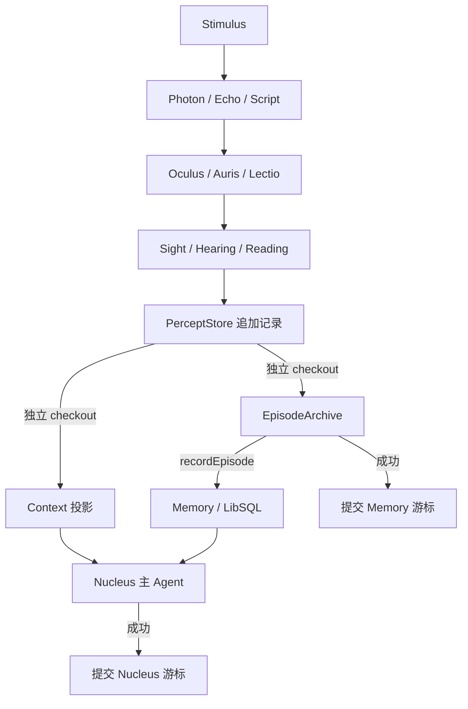

# @ciels/core

Ciel 的信号、感知、记忆与运行时编排核心。

## 工作流



一个 `Stimulus` 声明它会发送的信号类型。`Sensus` 自动将 `Echo`、`Photon`、`Script` 分别交给 `Auris`、`Oculus`、`Lectio`，产出 `Hearing`、`Sight`、`Reading`。

`PerceptStore` 为 Nucleus 与经历归档提供独立游标。调用失败时保留当前 checkout 供重试，新记录继续追加；成功后才提交对应游标。

## 使用

```ts
import { Ciel, Echo, Stimulus } from '@ciels/core';

class MicrophoneEcho extends Echo.WithMeta({
  name: '麦克风',
  description: '本机麦克风音频',
}) {}

const signals = [MicrophoneEcho] as const;

class Microphone extends Stimulus<typeof signals> {
  static readonly meta = {
    name: '本机麦克风',
    description: '通过本机麦克风观察到的场景',
  };

  readonly signals = signals;

  async start() {
    await this.send(
      new MicrophoneEcho({
        data: Buffer.alloc(320),
        startAt: new Date(),
      }),
    );
  }

  async stop() {}
}

const ciel = new Ciel(new Microphone(), {
  nucleus: { model, memory },
});

await ciel.start();
```

`Ciel.stop()` 会停止 Stimulus、解除订阅并关闭 Sensus；有状态的感官能力会先完成刷新。

## 主要导出

- `Ciel`：运行时生命周期与事件转发。
- `Stimulus`：声明信号并通过 `send()` 发送。
- `Sensus`：统一路由信号和管理感官能力。
- `Context`：构建最终模型输入。
- `Nucleus`：调度思考。
- `Memory`：基于 Mastra、LibSQL 和 LibSQLVector 的长期记忆与语义召回。
- `PerceptStore` / `InMemoryPerceptStore`：感知记录与独立消费游标。
- `VigiliaChannel` / `VigiliaGroup` / `VigiliaOperations`：模块观测源、组合与通用 operation 生命周期。
- `Echo` / `Photon` / `Script`：不可变信号基类。
- `Hearing` / `Sight` / `Reading`：保留来源信号的感知结果。

Context 按 `originSignal` 与感知类型组织实时输入，并合并内部设定、应用消息和记忆。Oculus 只持久化达到变化阈值的采样帧，每张上下文图片最多合成九帧。

Memory 要求显式提供 `resourceId`，并用它隔离全局记忆、每日经历、语义召回和幂等 ID，因此多个运行时可以共用同一数据库。多维业务标识使用 `createMemoryResourceId('app', 'account', accountId, 'scene', sceneId)` 逐段编码，避免自行拼接产生碰撞。

## Vigilia

每个模块都在实际执行位置通过 `VigiliaChannel` 产生自己的运行时事实，并用 `VigiliaGroup` 组合子模块。`Ciel` 只把根观测树连接到独立的进程内 `vigilia`，不再从外部推测 Sensus、Context、Nucleus、Memory 或 PerceptStore 的内部 operation。

原始 `VigiliaObservation` 可以携带尚未裁剪的运行时值；`Vigilia.observe()` 统一执行 capture、错误序列化和资源路径转换，之后才将 JSON 安全的 `VigiliaEvent` 提交给 Journal。整个旁路不参与感知或决策。

```ts
const off = ciel.vigilia.subscribe((event, snapshot) => {
  console.log(event.sequence, event.type, snapshot.state);
});

const history = ciel.vigilia.events({ after: 0, limit: 100 });
off();
```

独立组合模块时可以显式连接观测源：

```ts
const observations = new VigiliaGroup();
observations.add(memory.observations);
observations.add(nucleus.observations);

const disconnect = vigilia.connect(observations);
```

敏感内容默认不记录，可通过 `capture` 分项启用上下文、记忆、推理、结果和工具输入输出。音频、TypedArray 与内联图片会转为有界元数据；`signals: false` 只关闭高频原始信号事件。

OpenTelemetry 仅作为可选投影，不会安装 SDK 或 exporter：

```ts
const detach = new VigiliaOpenTelemetry().attach(ciel.vigilia);
```

## 验证

```bash
vp check
vp test
vp pack
```
