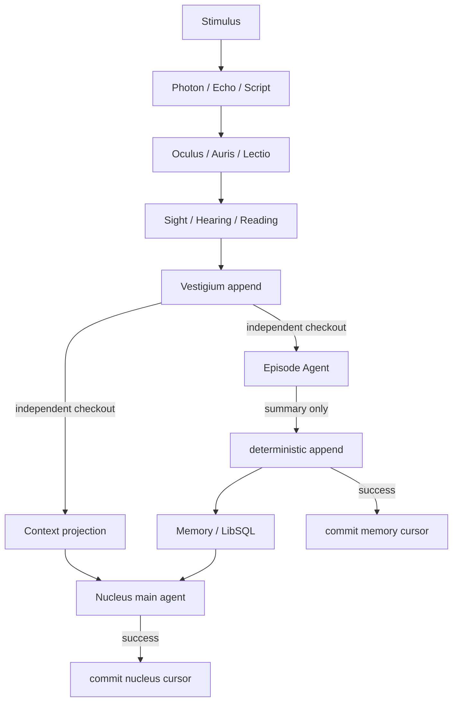

# @ciels/core

Signals, stimuli, percepts, sensory processors, and runtime orchestration for Ciel.

## Runtime

A stimulus declares every concrete signal class it can emit. `Ciel` creates one isolated `Sensus` for the stimulus, and `Sensus` binds every declared signal to its sensory capability.

```ts
import { Ciel, Echo, Stimulus } from '@ciels/core';

class MicrophoneEcho extends Echo.WithMeta({
  name: 'Microphone',
  description: 'Primary microphone audio',
}) {}

const signals = [MicrophoneEcho] as const;
const segment = { data: Buffer.alloc(320), startAt: new Date() };

class MicrophoneStimulus extends Stimulus<typeof signals> {
  static readonly meta = {
    name: 'Local microphone',
    description: 'The scene observed through the local microphone',
  };

  readonly signals = signals;

  async start() {
    await this.send(new MicrophoneEcho(segment));
  }

  async stop() {}
}

const ciel = new Ciel();
ciel.use(new MicrophoneStimulus());
await ciel.start();
```

Signal matching inside `Sensus` is automatic:

- `Echo` subclasses use an `Auris` processor.
- `Photon` subclasses use an `Oculus` processor.
- `Script` subclasses use a `Lectio` processor that aligns them as `Reading` percepts and emits them through Ciel's `data` event.

## Architecture



Both consumers receive stable checkouts. A failed call keeps its checkout for retry, while later
percepts continue to append. The Episode Agent receives multimodal prompt parts but no tools or store
handle; only deterministic Nucleus code appends the resulting Episode and advances the memory cursor.

`Ciel.stop()` stops stimuli, removes subscriptions, and closes each `Sensus`. Closing flushes stateful capabilities and releases their event listeners.

## Exports

- `Ciel`: stimulus registration and lifecycle orchestration.
- `Context`: trusted Stimulus/Signal definition and multimodal Percept prompt builder.
- `Memory`: Mastra Working Memory, date threads, and semantic recall backed by LibSQL and LibSQLVector.
- `Nucleus<TOutput>`: the many-stimuli thought and memory-summary scheduler.
- `Vestigium`: the append-only sensory journal shared by context construction and memory archiving.
- `Sensus`: unified signal routing, sensory capability, events, and lifecycle.
- `SensusBase<TSignal, TData>`: common signal binding and `data/error` event contract for sensory capabilities.
- `Stimulus`: typed event source with explicit `signals` and async `send()`.

Pass `nucleus` to `Ciel` to create its single lifecycle-managed `Nucleus`. Every registered
Stimulus feeds the same Nucleus while each realtime entry retains its source Stimulus. `Context`
builds the trusted base definitions and chronological text/image Percept input. Ciel forwards
`thought` and `error` events and exposes the runtime through `getNucleus()` and its current
realtime state through `getContext()`.

Oculus persists each sampled frame that differs enough from the last accepted frame. Every Sensus result
is first appended to `Vestigium`; Nucleus and memory archiving then read it through independent cursors.
A checkout stays frozen until its consumer commits it, so failed calls retry the same input while records
arriving during the call remain pending for the next checkout. Nucleus composes up to nine visual frames
into each context image. Prompt image count is bounded, but original image paths remain in Vestigium.

Nucleus privately adds `memory_update` for replacing refined global memory and `memory_recall` for
semantic search across historical date threads. Reaching the configured model-input token size, a quiet
period, or shutdown summarizes unread Percepts into the current date thread. Visual records are compacted
into bounded contact sheets for both thought and archive prompts. `Soul` and
`IDENTITY` are protected strings on `Ciel`; subclasses may
override them, and Context adds their Markdown headings when assembling the model prompt.

- `Echo`, `Photon`, `Script`: immutable signal bases with static metadata.
- `Auris`, `Oculus`, `Lectio`: lower-level signal-bound sensory capabilities.
- `Percept`: the `Hearing | Reading | Sight` result union.
- `Hearing`, `Reading`, `Sight`: percepts retaining their single origin signal constructor.

`triggerPolicy` can promote a newly appended record to `immediate`, leave it `scheduled`, or make it
`passive`. Hearing defaults to `immediate`: Auris emits a Hearing after the ASR/VAD segment closes, so
normal speech-end results can bypass `minThinkInterval` without coupling Nucleus to ASR internals.

The current Vestigium implementation is process-local. Its record and cursor contract is deliberately
separate from Nucleus so a durable LibSQL adapter can replace the storage backend without changing the
context or memory consumers.

## Development

```bash
vp check
vp test
vp pack
```
