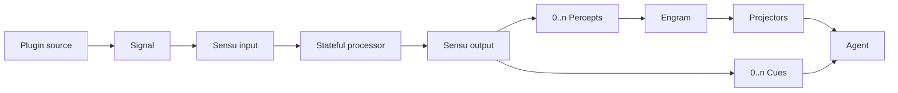

<h1 align="center">Corex</h1>

<p align="center">让外部世界成为可追踪的感知流，让 Ciel 在正确的时刻开始思考</p>

<p align="center">
  
  
  
</p>

<p align="center">
  <a href="#为什么是-corex">为什么是 Corex</a> ·
  <a href="#快速开始">快速开始</a> ·
  <a href="#运行模型">运行模型</a> ·
  <a href="#api-边界">API 边界</a>
</p>

> Corex is the perception and agent runtime behind Ciel

## 为什么是 Corex

普通事件总线擅长广播，却很难回答三个问题：输入如何形成感知、感知何时触发思考、一次输出最终写入了什么。

Corex 将这条链路拆成稳定边界：

- Signal 表达外部输入
- Sensu 以有状态流消费 Signal
- Percept 记录能够进入 Engram 的真实感知
- Cue 决定 Agent 何时思考
- Projector 将 Engram 快照整理为模型上下文
- Plugin 组织 Extension、Tool 与生命周期
- Interceptor 观察每一个关键运行边界

## 快速开始

```ts
import {
  defineCiel,
  defineCue,
  definePercept,
  definePlugin,
  defineSensu,
  defineSignal,
  referenceSignal,
} from 'corex';

const Message = definePercept({ name: 'message' });
const MessageReceived = defineCue({
  name: 'message-received',
  prompt: '请结合最新消息决定是否回应',
});
const messageSignal = defineSignal<string>({ name: 'message-input' });

const createMessageSensu = defineSensu((signal: typeof messageSignal) => ({
  name: 'message',
  signal,
  create({ output }) {
    return {
      async write(input) {
        await output.write({
          percepts: Message.create({
            origin: input.definition,
            causes: [referenceSignal(input)],
            temporal: input.temporal,
            contents: [{ type: 'text', text: input.payload }],
          }),
          cues: MessageReceived.create(input.temporal),
        });
      },
      close() {},
    };
  },
}));

const createInputPlugin = definePlugin((message: string) => ({
  name: 'message-source',
  create() {
    return {
      extensions: [createMessageSensu(messageSignal)],
      async activate({ emitSignal }) {
        await emitSignal(messageSignal.create(message, { kind: 'instant', at: Date.now() }));
      },
    };
  },
}));

const ciel = defineCiel({
  id: 'ciel-main',
  instructions: '你是夏尔',
  model,
  extensions: [createInputPlugin('你好')],
  tools: [businessTool],
});

await ciel.start();
await ciel.stop();
```

## 运行模型



一次 Signal 可以暂时没有输出，也可以产生多批输出。多个 Signal 也可以聚合成一个或多个 Percept 与
Cue。`SensuOutput.write()` 会先提交同批 Percept，再排入 Cue，并返回实际 Engram entries 与 Cue 数量。

`Percept.origin` 表达产生感知的 Signal Definition。只有能够准确证明因果时才填写
`Percept.causes`，聚合流不需要伪造单一来源。

## API 边界

### Plugins

Plugin 是可安装的组合能力。它负责创建 Extension、贡献 Tool，并管理外部资源。

```ts
interface PluginInstance {
  readonly extensions?: readonly (ProjectorExtension | SensuExtension)[];
  readonly tools?: readonly AgentTool[];

  initialize?(): MaybePromise<void>;
  activate?(context: { emitSignal: EmitSignal }): MaybePromise<void>;
  deactivate?(): MaybePromise<void>;
  dispose?(): MaybePromise<void>;
}
```

生命周期顺序固定为：

1. 按声明顺序执行 `initialize`
2. 安装 Sensu 并启动 Agent
3. 按声明顺序执行 `activate`
4. 逆序执行 `deactivate`
5. 逆序关闭 Sensu 并停止 Agent
6. 逆序执行 `dispose`

### Extensions

`extensions` 是统一安装入口，可接收 Plugin 和独立运行能力：

- `definePlugin(factory)` 创建组合能力与生命周期
- `defineSensu(factory)` 创建 Signal 流处理器
- `defineProjector(options)` 创建 Engram 投影
- `defineInterceptor(options)` 安装全局拦截器

Plugin 内部只可贡献 Sensu 与 Projector。Interceptor 必须静态声明在 Plugin options 上，以便 Corex
在创建任何 PluginInstance 前构造完整拦截链。

### Tools

Tool 保持原生 `AgentTool` 形状，不需要包装为 Extension：

```ts
defineCiel({
  model,
  instructions,
  tools: [hostTool],
  extensions: [memoryPlugin, telemetryExtension],
});
```

Plugin 贡献的 Tool 自动携带 `pluginId` 与 `pluginName`。顶层 Tool 只携带自身名称和标签。主 Agent
的 Tool 不会进入 `PluginCreateContext.agent`，因此内部子 Agent 不会意外继承宿主能力。

### Instrument

每个 Plugin 与 Extension 都会获得绑定可信身份的 `Instrument`：

```ts
const requestInstrument = context.instrument.with({
  name: 'ciel.example.request',
  metadata: { subsystem: 'example' },
});

const read = requestInstrument.with({ metadata: { operation: 'read' } })(load);
```

派生 Instrument 可以继续派生。预设 metadata 优先于调用处 metadata。name 一旦固定，下层只能省略或
传入相同值。

## 会话与 Engram

`id` 是稳定的 Ciel 隔离标识，`sessionId` 是一次对话标识。Agent 每轮 checkout 尚未消费的
Percept，成功后才提交，失败时下轮仍会看到同一批增量。

默认会话保存在 `.ciel`。传入稳定的 `id` 与 `sessionId` 可以跨进程恢复，也可以通过
`sessionStore: false` 禁用持久化。

## 开发

```shell
vp install
vp check
vp test --run
vp pack
```
