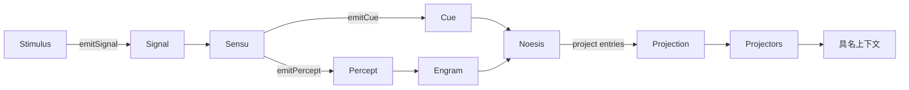

# Corex

Corex 是 Ciel 的模块化运行时。它负责连接外部输入、感知处理、实时感知记录和认知触发，
并提供可复用的上下文投影与函数拦截能力。

## 整体流程



数据流由 `Signal`、`Percept` 和 `Cue` 串联。`Ciel` 收集并安装模块，`Interceptor`
则可以包裹关键函数边界，而不改变各模块的业务职责。

## 核心概念

### 运行时与模块

| 名称          | 定义方式              | 作用                                                               |
| ------------- | --------------------- | ------------------------------------------------------------------ |
| `Ciel`        | `defineCiel()`        | 运行时容器，收集模块、连接事件总线、持有 Engram 并管理启动和停止。 |
| `Stimulus`    | `defineStimulus()`    | 接入外部输入，在 `setup()` 中产生一个或多个 Signal。               |
| `Sensu`       | `defineSensu()`       | 订阅指定 Signal，将原始输入解释为 Percept，并在合适时产生 Cue。    |
| `Noesis`      | `defineNoesis()`      | 订阅 Cue，读取 Engram，并执行思考、决策或其他认知逻辑。            |
| `Projection`  | `defineProjection()`  | 将一组具名 Projector 注册为 Noesis 可选择的上下文投影方案。        |
| `Interceptor` | `defineInterceptor()` | 为运行时函数边界添加日志、追踪、计时等横切行为。                   |

`Stimulus`、`Sensu`、`Noesis`、`Projection` 和 `Interceptor` 都是可放入
`defineCiel({ modules })` 的顶层模块。每个模块都有独立的 UUIDv7 `id`，`name` 主要用于展示
和诊断，运行时路由不依赖名称。

### 定义与数据

| 名称                            | 定义方式          | 作用                                                                            |
| ------------------------------- | ----------------- | ------------------------------------------------------------------------------- |
| `SignalDefinition` / `Signal`   | `defineSignal()`  | 描述原始输入类型，并创建携带 `payload` 和 `temporal` 的 Signal。                |
| `PerceptDefinition` / `Percept` | `definePercept()` | 描述感知类型，并创建带来源 Signal、多模态内容、时间范围和可选置信度的 Percept。 |
| `CueDefinition` / `Cue`         | `defineCue()`     | 描述认知触发条件，并创建携带 payload 和时间信息的 Cue。                         |

Definition 是稳定的类型化工厂，Data 是一次具体事件。Signal、Percept 和 Cue 都保留自己的
Definition，因此事件总线和 Engram 可以按 Definition 的 `id` 精确路由或筛选。

### 共享设施

| 名称           | 作用                                                                              |
| -------------- | --------------------------------------------------------------------------------- |
| `Engram`       | 按写入时间记录 Percept，支持全量、最近窗口、时间范围、Definition 筛选和游标读取。 |
| `EngramReader` | Noesis 获得的只读 Engram 接口。                                                   |
| `EngramView`   | 一次 Projection 输入形成的固定只读快照，只允许读取快照内的条目。                  |
| `Projector`    | 可复用的投影函数，从 EngramView 生成一种具名上下文结果；它本身不需要注册到 Ciel。 |

## 各模块职责

### Ciel

`defineCiel()` 接收模块或模块数组，并为每个 Ciel 实例创建相互隔离的事件总线、Engram、
Projection 注册表和 Instrumenter。

启动顺序固定，不受 `modules` 中的排列顺序影响：

1. 先安装 Engram 监听，避免启动阶段产生的 Percept 漏记。
2. 安装所有 Sensu，使 Signal 发出前已有消费者。
3. 安装所有 Noesis，使 Cue 发出前已有消费者。
4. 最后安装 Stimulus，允许其在 `setup()` 中立即产生 Signal。

模块通过 `ctx.onDispose()` 注册清理函数。停止或启动失败时，Ciel 按模块作用域的相反顺序
执行清理；多个清理错误会合并为 `AggregateError`。停止 Ciel 不会自动清空 Engram，重新启动
同一个实例时仍可读取此前保留的 Percept。

### Stimulus 与 Signal

Stimulus 负责输入边界，例如麦克风、页面事件、定时器或外部消息。它只产生 Signal，不直接
写入 Engram，也不负责理解输入内容。

```ts
const messageSignal = defineSignal<string>({
  name: 'message',
  description: '外部文字消息',
});

const messageInput = defineStimulus({
  name: 'message-input',
  async setup(ctx) {
    await ctx.emitSignal(
      messageSignal.create('你好', {
        kind: 'instant',
        at: Date.now(),
      }),
    );
  },
});
```

`Temporal` 可以是瞬时事件 `{ kind: 'instant', at }`，也可以是时间区间
`{ kind: 'interval', start, end }`。

### Sensu 与 Percept

Sensu 使用 `ctx.onSignal(definition, handler)` 订阅具体 SignalDefinition。处理结果通过
`ctx.emitPercept()` 形成 Percept；该 Promise 完成时，Percept 已经经过事件总线并写入 Engram。

Percept 的 `contents` 可以混合 `text`、`image` 和 `audio`，并通过 `source` 保留产生它的原始
Signal。Sensu 可以在感知处理完成后继续发出 Cue，通知 Noesis 开始认知处理。

### Engram

Engram 保存的是 `EngramEntry`，而不是裸 Percept。每个条目额外包含当前 Engram 内递增的
`sequence` 和实际写入时间 `recordedAt`；Percept 自己的 `temporal` 仍表示事件对应的时间。

主要读取方式：

- `all()`：读取当前保留的全部条目。
- `recent(durationMs?)`：读取最近窗口，省略参数时使用 Engram 默认窗口。
- `between(from, to)`：读取左闭右开的写入时间范围。
- `entries(perceptDefinition)`：按 PerceptDefinition 筛选当前保留条目。
- `createCursor()`：按固定时间窗口逐段读取。

Corex 创建的 Ciel 当前使用五分钟默认窗口，但没有配置自动保留期限；直接调用
`createEngram()` 时可以分别配置 `windowMs` 和 `retentionMs`。

### Cue 与 Noesis

Cue 表示“现在值得进行一次认知处理”，例如语音结束、手动请求或定时思考。Cue 不会写入
Engram；它只通过 Cue 总线触发订阅了对应 CueDefinition 的 Noesis。Ciel 外部也可以调用
`ciel.emitCue()` 手动派发 Cue。

Noesis 可以直接读取 `ctx.engram`。如果声明了 `projection`，还可以将选定的 Engram 条目交给
`ctx.project()`，得到类型由 Projector 对象 key 自动推导的具名 LLM 上下文。只响应 Cue 而不需要投影
的 Noesis 可以省略 `projection`。

### Projector 与 Projection

Projector 封装一种可复用的上下文转换。Projection 使用对象为多个 Projector 命名，并作为
顶层模块注册到 Ciel：

```ts
const speechProjector = defineProjector({
  name: 'speech',
  project({ engram }) {
    return engram
      .entries(speechPercept)
      .flatMap(entry =>
        entry.value.contents.flatMap(content =>
          content.type === 'text' ? [{ type: 'text', text: content.text }] : [],
        ),
      );
  },
});

const agentProjection = defineProjection({
  name: 'agent-context',
  projectors: {
    speech: speechProjector,
    vision: visionProjector,
  },
});
```

`ctx.project(entries)` 会先复制输入条目，创建固定的 EngramView，再并行执行所有 Projector。
每个 Projector 必须返回统一的 `LLMContext` 多模态内容格式；结果仍使用对象中的 key：

```ts
const context = await ctx.project(ctx.engram.recent());

context.speech;
context.vision;
```

同一个 Projector 可以被多个 Projection 复用。Projection 必须和引用它的 Noesis 一起注册到
当前 Ciel；缺失注册会使 Ciel 拒绝启动。任一 Projector 失败时，本次 `project()` 整体失败。

### Interceptor

Interceptor 在 Ciel 实例内部组成 Instrumenter。`intercept(target)` 返回 wrapper 时包裹目标，
返回 `undefined` 时跳过；先声明的 Interceptor 位于组合调用链的外层。

当前会 instrument 的边界包括：

- Stimulus、Sensu 和 Noesis 的 `setup()`。
- `emitSignal()`、`emitPercept()` 和 `emitCue()`。
- `onSignal()` 与 `onCue()` 注册的 handler。
- Projection 中每个 Projector 的 `project()`。

Interceptor 适合实现观测和控制，不应承载 Signal、Percept 或 Cue 的业务转换逻辑。不同 Ciel
实例拥有不同的 Instrumenter，彼此不会共享拦截状态。

## 完整示例

下面的最小流程将文字 Signal 转为 Percept，写入 Engram，再通过 Cue 触发 Noesis 投影：

```ts
import {
  defineCiel,
  defineCue,
  defineNoesis,
  definePercept,
  defineProjection,
  defineProjector,
  defineSensu,
  defineSignal,
  defineStimulus,
} from '@ciels/corex';

const temporal = { kind: 'instant', at: Date.now() } as const;
const messageSignal = defineSignal<string>({ name: 'message' });
const speechPercept = definePercept({ name: 'speech' });
const thinkingCue = defineCue<void>({ name: 'thinking' });

const speechSensu = defineSensu({
  name: 'speech',
  setup(ctx) {
    ctx.onSignal(messageSignal, async signal => {
      await ctx.emitPercept(
        speechPercept.create({
          source: signal,
          contents: [{ type: 'text', text: signal.payload }],
          temporal: signal.temporal,
        }),
      );
      await ctx.emitCue(thinkingCue.create(undefined, signal.temporal));
    });
  },
});

const speechProjector = defineProjector({
  name: 'speech',
  project({ engram }) {
    return engram
      .entries(speechPercept)
      .flatMap(entry =>
        entry.value.contents.flatMap(content => (content.type === 'text' ? [content.text] : [])),
      );
  },
});

const agentProjection = defineProjection({
  name: 'agent-context',
  projectors: { speech: speechProjector },
});

const agent = defineNoesis({
  name: 'agent',
  projection: agentProjection,
  setup(ctx) {
    ctx.onCue(thinkingCue, async () => {
      const context = await ctx.project(ctx.engram.recent());
      console.log(context.speech);
    });
  },
});

const input = defineStimulus({
  name: 'input',
  async setup(ctx) {
    await ctx.emitSignal(messageSignal.create('你好', temporal));
  },
});

const ciel = defineCiel({
  modules: [agentProjection, speechSensu, agent, input],
});

try {
  await ciel.start();
} finally {
  await ciel.stop();
}
```

## 开发

```bash
vp install
vp check
vp test
vp pack
```
