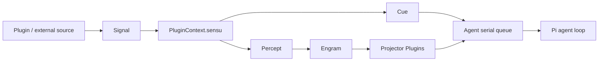

# Corex

Corex 是 Ciel 的感知与 Agent 运行时。一个 `Ciel` 固定绑定一个内部 Agent；所有扩展能力统一
实现为 `CielPlugin`，不再按感知、输入源或拦截器划分插件种类。

## 数据流



- Signal 是运行时输入事件。
- Plugin 通过 `sensu()` 把 Signal 转换为 Percept，并可返回触发思考的 Cue。
- Engram 只保存真实 Percept，是短中期感知日志。
- Projector Plugin 把一次稳定的 Engram 快照转换成具名模型上下文。
- 内部 Agent 串行处理 Cue，并管理 Pi 消息历史和工具循环。

解释器会先把同批 Percept 写入 Engram，再把 Cue 放入 Agent 队列。它不等待模型完成，因此输入
不会被一次长思考阻塞；同一 Ciel 内的思考仍严格串行。

## Ciel

```ts
defineCiel({
  id,
  sessionId,
  sessionStore,
  instructions,
  model,
  prompt,
  onAgentEvent,
  plugins,
  // 其余 Pi AgentLoopConfig 选项也平铺在这里
});
```

`instructions` 会原样作为内部 Agent 的 system prompt。Corex 不再组合人格或业务提示词。

## Plugin

`definePlugin()` 只接受一个配置工厂，并返回具体 Plugin 的定义函数：

```ts
interface MemoryOptions {
  readonly name: string;
  readonly description?: string;
  readonly path: string;
}

const memoryPlugin = definePlugin((options: MemoryOptions) => ({
  name: options.name,
  description: options.description,

  setup(ctx) {
    const namespace = ctx.id;
    // 不包含主 Ciel 的 instructions、会话、Tools 与 prompt。
    const inheritedAgentConfig = ctx.agent;

    ctx.provide({
      tools: [memoryRecall, memoryUpdate],
      projectors: [memoryProjector],
      interceptors: [observer],
    });

    const memoryRuntime = createMemory({ path: options.path });
    ctx.onStart(() => memoryRuntime.start(inheritedAgentConfig, namespace));
    ctx.onDispose(() => memoryRuntime.close());
  },
}));

const memory = memoryPlugin({
  name: 'memory',
  path: '.ciel/memory.db',
});
```

所有 Plugin 获得同一个扁平 `PluginContext`：

```ts
interface PluginContext {
  readonly id: string;
  readonly agent: AgentConfig;
  readonly sensu: Sensu;
  readonly emitSignal: EmitSignal;
  readonly instrument: Instrument;

  provide(contribution: PluginContribution): void;
  onStart(start: Dispose): void;
  onDispose(dispose: Dispose): void;
}
```

`PluginOptions` 包含 `name`、可选 `description`、`tools`、`projectors`、`interceptors` 和可选
`setup`。静态能力直接声明在 options；依赖 `ctx.id` 或 `ctx.agent` 才能创建的能力，通过
`setup()` 中的 `ctx.provide()` 追加。

`setup()` 在 `defineCiel()` 期间同步执行，仅用于声明能力和生命周期。异步初始化或外部资源接入
放入 `onStart()`；setup 返回后再调用 `provide()`、`sensu()` 等注册方法会报错。

运行时先安装全部 `sensu()` 订阅，再启动 Agent，最后按 plugins 声明顺序执行 `onStart()`。
因此任意 Plugin 都可以在 `onStart()` 中安全调用 `emitSignal()`，且不依赖插件类别或安装顺序。
停止时 Plugin 按相反顺序清理，然后停止 Agent 和 Signal 订阅。启动前或停止后调用
`emitSignal()` 会失败。`instrument()` 使用当前 Ciel 的 `@ciels/interceptor` 链包装 Plugin 内部操作，
并为显式 `InstrumentContext` 自动追加 `pluginId` 与 `pluginName`；包装后的操作也只能在运行期间执行。

Tools 按 `name` 合并，Projectors 按对象 key 合并；与 `defineCiel()` 直接配置或其他 Plugin 重名时
会在构造阶段报错。

## 完整示例

```ts
import { builtinModels } from '@earendil-works/pi-ai/providers/all';
import {
  defineCiel,
  defineCue,
  definePlugin,
  definePercept,
  defineProjector,
  defineSignal,
} from 'corex';

const model = builtinModels().getModel('openai', 'gpt-5-mini')!;
const messageSignal = defineSignal<string>({ name: 'message' });
const messagePercept = definePercept({ name: 'message' });
const thinkCue = defineCue({ name: 'new-message', prompt: '请根据最新消息决定是否回应。' });

const defineInput = definePlugin((options: { readonly message: string }) => ({
  name: 'message-input',
  setup(ctx) {
    ctx.sensu(messageSignal, signal => ({
      percepts: messagePercept.create({
        source: signal,
        temporal: signal.temporal,
        contents: [{ type: 'text', text: signal.payload }],
      }),
      cues: thinkCue.create(signal.temporal),
    }));

    ctx.onStart(() => {
      const temporal = { kind: 'instant', at: Date.now() } as const;
      return ctx.emitSignal(messageSignal.create(options.message, temporal));
    });
  },
}));

const input = defineInput({ message: '你好' });

const messages = defineProjector({
  name: 'messages',
  project({ engram }) {
    return engram
      .entries(messagePercept)
      .flatMap(entry => entry.value.contents)
      .filter(content => content.type === 'text');
  },
});

const ciel = defineCiel({
  id: 'ciel-main',
  sessionId: new Date().toISOString().slice(0, 10),
  instructions: '你是夏尔。',
  model,
  plugins: [messages, input, businessToolPlugin],
});

await ciel.start();
await ciel.stop();
```

## 会话与 Engram

`id` 是稳定的 Ciel/资源隔离标识，`sessionId` 是一次对话标识。默认 Session key 同时包含两者；
要跨进程恢复，调用方必须提供稳定的 `id` 和 `sessionId`。默认使用 `.ciel` 下的 Pi JSONL
Session，也可传入 `createAgentSessionStore()` 或用 `sessionStore: false` 禁用。

Agent 每轮开始时 checkout 尚未消费的 Percept，Projector 读取不超过该边界的最近快照。Pi loop
成功后才提交 checkout；失败时下轮仍会看到同一增量。思考期间新增的 Percept 留给下一轮。

长期记忆不写回 Engram：它应由 Plugin 通过 Tools 写入、通过 Tool 或 Projector 检索，并拥有自己的
持久化与生命周期。

## 可观测边界

Plugin 通过 `interceptors` 或 `ctx.provide()` 提供 `@ciels/interceptor` 拦截器。稳定操作名包括
`AgentThink`、`AgentPrompt`、`AgentGenerate`、`AgentToolExecute`、`PluginStart`、
`ProjectorProject`、`Sensu` 和 `SignalEmit`。

## 开发

```bash
vp install
vp check
vp test
vp pack
```
