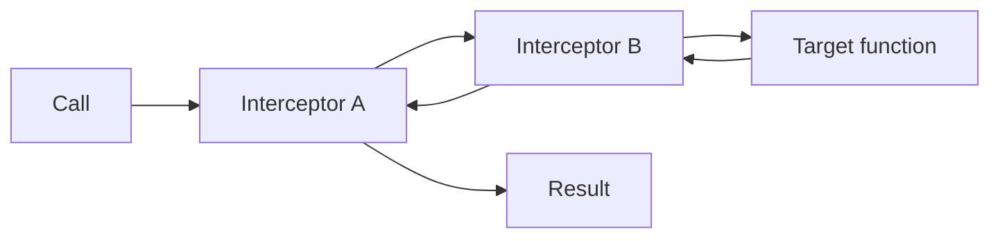

<h1 align="center">@ciels/interceptor</h1>

<p align="center">为普通函数建立轻量、可组合、带可信上下文的观测边界</p>

<p align="center">
  
  
  
</p>

> Instrument business operations without coupling them to a telemetry backend

## 为什么需要它

业务函数不应该知道日志、trace 或调试器如何工作。Interceptor 只定义一个很小的协议：观察目标与
静态上下文，按需返回 wrapper，并保持原函数调用签名。

- 不绑定 OpenTelemetry 或任何日志实现
- 同步函数与异步函数使用相同协议
- Interceptor 可按顺序组合
- Instrument 可派生并固定可信身份
- 未命中的 Interceptor 不进入调用链

## 快速开始

```ts
import { createInstrumenter } from '@ciels/interceptor';
import type { AnyFunction, Interceptor } from '@ciels/interceptor';

const logger: Interceptor = {
  intercept<T extends AnyFunction>(target: T, context) {
    return next =>
      function (this: ThisParameterType<T>, ...args: Parameters<T>) {
        console.log(context?.name ?? target.name, context?.metadata, args);
        return Reflect.apply(next, this, args);
      } as T;
  },
};

const instrument = createInstrumenter([logger]);
const greet = instrument((name: string) => `Hello, ${name}`, {
  name: 'example.greet',
  metadata: { source: 'README' },
});

greet('Ciel');
```

## 派生可信上下文

```ts
const pluginInstrument = instrument.with({
  metadata: {
    pluginId: 'memory',
    pluginName: 'Memory',
  },
});

const searchInstrument = pluginInstrument.with({
  name: 'ciel.memory.search',
  metadata: { capability: 'memory' },
});

const search = searchInstrument(loadMemory, {
  name: 'ciel.memory.search',
  metadata: {
    pluginId: 'forged',
    operation: 'semantic-search',
  },
});
```

合并后的 metadata 会保留真实 `pluginId`，同时包含 `capability` 与 `operation`。越靠近所有者的
预设拥有越高优先级。一旦某层固定 name，后续层传入不同 name 会立即抛错。

## 调用链



先声明的 Interceptor 位于外层。每个 Instrumenter 独立匹配并缓存 wrapper 组合，不会污染其他
Instrumenter。

## 协议

```ts
interface Interceptor {
  intercept<T extends AnyFunction>(
    target: T,
    context?: InstrumentContext,
  ): InterceptorWrapper<T> | undefined;
}

interface Instrument {
  <T extends AnyFunction>(target: T, context?: InstrumentContext): T;
  with(preset: InstrumentPreset): Instrument;
}
```

返回 `undefined` 表示跳过目标。返回 wrapper 时必须保持目标的参数、返回值与 `this` 语义。

## 开发

```shell
vp check
vp test --run
vp pack
```
