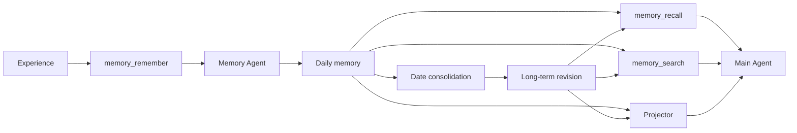

<h1 align="center">@ciels/memory</h1>

<p align="center">让 Ciel 记住经历、维护长期事实，并在正确的场景重新想起它们</p>

<p align="center">
  
  
  
</p>

> Agentized daily memory, long-term revisions, deterministic search, and semantic recall

## 为什么需要分层记忆

对话历史只能告诉模型刚刚发生了什么，无法稳定表达跨日期事实，也无法隔离不同直播间、项目或人物。

`@ciels/memory` 将记忆拆成三个边界：

- Namespace 负责实例级硬隔离
- Scope 负责同一实例中的业务场景隔离
- Daily 与 Long-term 负责经历和稳定事实的不同生命周期

## 快速开始

```ts
import { memoryPlugin } from '@ciels/memory';
import { defineCiel } from '@cieljs/core';

const memory = memoryPlugin({
  name: 'memory',
  scope: () => ({
    id: `room:${currentRoom.id}`,
    label: currentRoom.name,
  }),
  store: { path: '.ciel-data/memory' },
  embedder, // 可选,未配置时使用文本候选召回
  agent: { maxTurns: 4 },
  instructions: '只记录可以确认的事实',
  projector: {
    recentDays: 3,
    maxEntriesPerDay: 20,
  },
});

const ciel = defineCiel({
  id: 'blive-main',
  instructions,
  model,
  plugins: [memory],
});

await ciel.start();
await ciel.stop();
```

Memory Agent 继承主 Ciel 的 model、stream 等模型配置，但不会继承 instructions、会话历史、主 Agent
Tools 或 prompt。它拥有独立提示词和任务队列。

Memory Plugin 还会把记忆工具的使用规则追加到主 Agent 系统提示词。主 Agent 负责判断何时保存、
更新或检索记忆，独立 Memory Agent 只负责整理和筛选传入的记忆任务。

## 记忆如何流动



## 数据模型

PGlite 是唯一事实库，正文与向量索引分开保存：

```text
PGlite
├── daily_memory_entries         每日记忆正文
├── long_term_memory_revisions   长期记忆正文与 revision
├── memory_namespaces            Namespace
├── memory_scopes                Scope
├── memory_consolidated_dates    已结算日期
└── memory_embeddings            pgvector 语义索引
```

正文始终保存在关系表中。`memory_embeddings` 只负责候选召回，不替代原始内容。当前不会写出
`MEMORY.md` 或每日 Markdown 文件。

`embedder` 可选。配置后使用 pgvector 生成语义候选；未配置时优先使用文本命中，再用最近记忆
补足候选，正文写入、长期 revision、Projector 和所有 Tools 仍保持可用。

## 隔离规则

- Namespace 默认使用 `ciel.id`，也可由 `MemoryOptions.id` 覆盖
- Scope 由 `scope()` 动态返回
- `current` 只访问当前 Scope
- `global` 只访问全局记忆
- `all` 显式执行跨 Scope 检索，并保留结果来源

## Tools

Memory Plugin 直接向主 Agent 贡献原生 Tools。

| Tool              | 作用                              |
| ----------------- | --------------------------------- |
| `memory_remember` | 总结经历并写入每日记忆            |
| `memory_update`   | 根据更正生成新的长期记忆 revision |
| `memory_recall`   | 召回候选并由 Memory Agent 整理    |
| `memory_search`   | 确定性搜索原始记录与结构化字段    |

## Projector

Projector 默认向主 Agent 提供：

1. 全局长期记忆
2. 当前 Scope 长期记忆
3. 当前 Scope 最近若干天的每日记忆

Projector 只读取已提交数据，不调用模型，也不会隐式写入记忆。

## 日期结算

长期记忆通过完整 revision 更新，旧 revision 始终保留。跨天结算是惰性的，在新日期首次写入、
`flush()` 或 `close()` 时处理已经结束的日期，不需要常驻定时器。

## 配置

```ts
interface MemoryOptions {
  readonly name: string;
  readonly description?: string;
  readonly id?: string;
  readonly scope?: () => MemoryScope | undefined;
  readonly store: MemoryStoreOptions | MemoryStore;
  readonly embedder?: MemoryEmbeddingModel;
  readonly instructions?: string;
  readonly prompts?: Partial<MemoryPrompts>;
  readonly agent?: Partial<AgentConfig>;
  readonly projector?: MemoryProjectorOptions;
  readonly tools?: MemoryToolOptions;
  readonly now?: () => number;
}
```

底层场景可以调用 `createMemory()` 获取 `tools`、`projector`、`start()`、`flush()` 与 `close()`。
通常直接使用 `memoryPlugin()` 即可。

## 开发

```shell
vp check
vp test --run
vp pack
```
