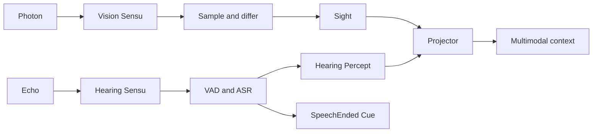

<h1 align="center">@ciels/sensu</h1>

<p align="center">赋予 Ciel 眼睛与耳朵，将连续世界整理成可消费的感知</p>

<p align="center">
  
  
  
</p>

> Visual change detection, streaming ASR, VAD cues, and multimodal projection for Corex

## 它能感知什么

- Photon Signal 经过采样与变化检测后形成 `Sight` Percept
- Echo Signal 以 16 kHz PCM 流进入 VAD 与 ASR
- VAD speech-end 始终形成 `SpeechEnded` Cue；尚未开始的同类思考会按 CueDefinition id 合并
- 识别成功时额外形成带说话人的 `Hearing` Percept
- Projector 将听觉时间线与视觉变化帧组合为模型上下文
- ASR 输入、输出和 Corex 提交结果拥有完整插装边界

## 快速开始

```ts
import { defineCiel } from '@cieljs/core';
import { defineEcho, definePhoton, sensuPlugin } from '@ciels/sensu';

const screen = definePhoton({
  name: 'screen',
  description: '桌面画面',
});

const microphone = defineEcho({
  name: 'microphone',
  description: '麦克风音频',
});

const sensu = sensuPlugin({
  name: 'sensu',
  vision: {
    signals: [screen],
    sampleInterval: 60_000 / 9,
    differenceThreshold: 0.03,
  },
  hearing: {
    signals: [microphone],
    asr: {
      bufferSeconds: 30,
      speaker: [{ name: 'Alice', file: '.ciel-data/voiceprints/alice.voiceprint' }],
      speakerThreshold: 0.6,
      maxSpeakers: 8,
    },
  },
  projector: {
    maxVisionFrames: 9,
    visionPrompt: '结合画面顺序理解视觉变化',
    hearingPrompt: '结合来源和说话人理解听觉内容',
  },
});

const ciel = defineCiel({
  model,
  instructions: '你是夏尔',
  plugins: [sensu],
});

await ciel.start();
await ciel.dispatchSignal(
  screen.create({ data: imageBuffer }, { kind: 'instant', at: Date.now() }),
);
await ciel.dispatchSignal(
  microphone.create({ data: pcmBuffer }, { kind: 'interval', start: startedAt, end: endedAt }),
);
```

## 感知流



一个 VAD 区间可以聚合多个 Echo Signal。Sensu 不会创建内部 speech Signal，也不会假设输入与
Percept 一一对应。没有 ASR 文本时仍会发出 `SpeechEnded`，因此 Agent 可以可靠观察语音结束。

关闭时 Corex 先断开新输入，再让 ASR flush，并等待全部 speech-end 输出写入 Engram。

## 输入格式

### Photon

`PhotonPayload.data` 接受 Sharp 可读取的图片 `Buffer`。

### Echo

`EchoPayload.data` 固定为：

- 16 kHz
- 单声道
- signed 16-bit little-endian PCM

## Projector

听觉按时间排列并保留 Echo Definition 来源、说话人与文本。视觉按 Photon Definition 来源分组，
每个来源均匀选择最多 `maxVisionFrames` 帧，并合成为 1920×1080 JPEG。

`visionPrompt` 与 `hearingPrompt` 分别控制两类上下文提示词。传入空字符串可以关闭对应内置提示词。

## 可观测边界

| Operation               | 输入                | 输出                 |
| ----------------------- | ------------------- | -------------------- |
| `ciel.sensu.asr.input`  | PCM 与开始时间      | ASR write 结果       |
| `ciel.sensu.asr.output` | 完整 speech segment | `SensuOutputReceipt` |

Corex 自动附加 Plugin 与 Sensu 身份。Sensu 再附加 Signal Definition 信息，因此可以从一次 ASR
输出追踪到实际写入的 Engram entries 与 Cue 数量。

## 开发

```shell
vp check
vp test --run
vp pack
```
